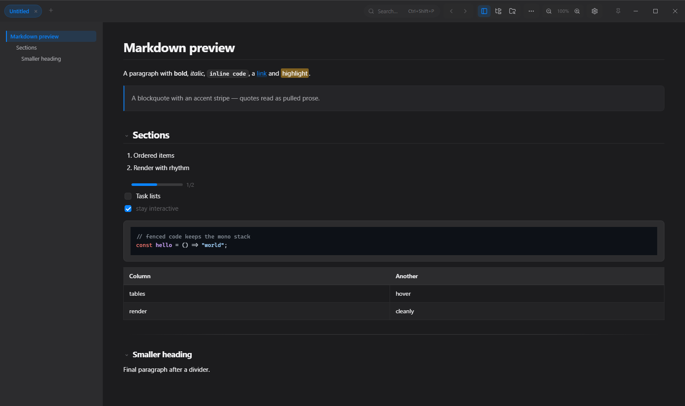
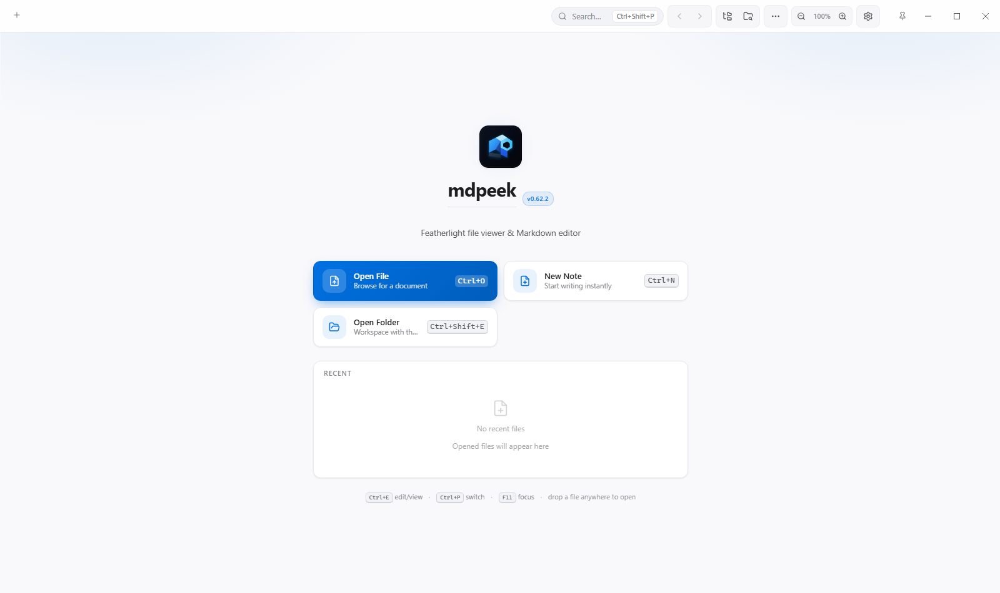
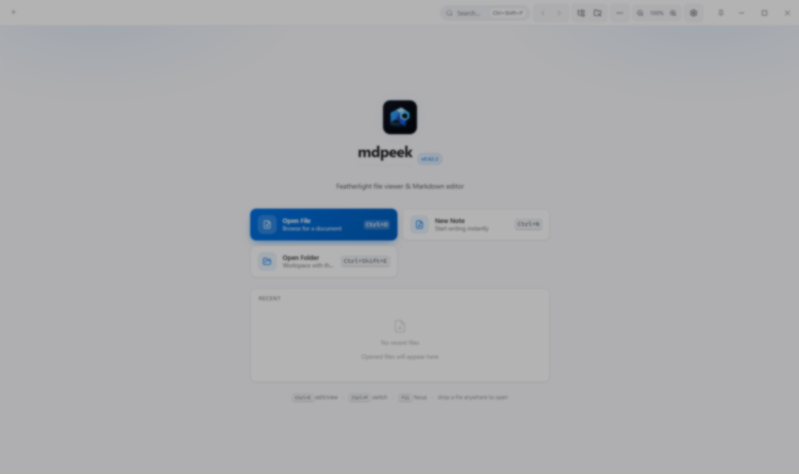

<div align="center">

# mdpeek

**A tiny but mighty file viewer, Markdown editor, integrated PowerShell terminal, reading mode, and collaboration tool for Windows.**

Render Markdown beautifully, view PDFs / code / images / CSV / Excalidraw / tldraw /
Jupyter notebooks, edit with live preview, run PowerShell commands, present slideshows,
read distraction-free, sketch on PDFs, link notes with `[[wiki-links]]`, browse a graph
of your knowledge, time-travel through snapshots, share a document for real-time P2P
editing, and manage a Workspace hub (board, calendar, tasks, review, pomodoro) — all in
a ~7 MB package that installs in seconds.

[](https://tauri.app)
[](LICENSE)
[](https://github.com/sanketpatel32/Mdpeek/releases/latest)
[](https://github.com/sanketpatel32/Mdpeek/releases/latest)
[](CHANGELOG.md)
[](#-build)
[](https://github.com/sanketpatel32/Mdpeek/releases/latest)

Built with **Tauri 2 + vanilla JS**. Uses the system WebView2 (no bundled
Chromium), making it far smaller than Electron-based viewers like MarkText
(~90 MB) or mdview (~70 MB).

[Features](#-features) · [Screenshots](#-screenshots) · [Install](#-install) · [Shortcuts](#-keyboard-shortcuts) · [Build](#-build) · [Contributing](#-contributing) · [Changelog](CHANGELOG.md)



</div>

---

## 📸 Screenshots

| Editing a document (Dark) | Home screen (Light) | Settings (Light) |
| ------------------------- | ------------------- | ---------------- |
|  |  |  |

---

## ✨ Features

### 💻 Integrated Terminal (real PTY, VS Code-style)
- **Built-in PowerShell console (`Ctrl+\``)** — a toggleable bottom drawer backed by a **real pseudo-terminal** (Windows ConPTY) running PowerShell. The same architecture VS Code uses: streaming output, full ANSI colors, interactive commands (`node`, `python`, `vim`), Ctrl+C, persistent `cd`/env/aliases, and the prompt actually reflects the live shell.
- **Multi-tab** — each tab is an independent PTY; switching preserves scrollback.
- **xterm.js renderer** — the exact terminal renderer VS Code ships. Theme-synced with the active app theme.
- **Drag-and-drop** — drop a file onto the terminal and its path is written into the live shell input.
- **Resize** — drag the top edge of the drawer to resize; cols/rows propagate to the PTY.

### 📝 Markdown rendering & Editing
- **GitHub-flavored Markdown** — headings, tables, task lists, strikethrough, footnotes
- **Syntax highlighting & Code Actions** — 190+ languages (highlight.js) with "Copy code" and **"Save code block as file"** actions auto-detecting file extensions (`.js`, `.py`, `.rs`, `.json`, etc.)
- **Snippet & Template Picker (`Ctrl+Shift+S`)** — quick launcher to insert Markdown callouts (`[!NOTE]`, `[!TIP]`, `[!WARNING]`), 3x3 tables, task lists, code blocks, KaTeX math blocks, and meeting notes
- **Visual table editor** — edit the GFM table under the caret in a grid modal instead of fighting pipes and padding
- **Inline autocomplete** — an as-you-type dropdown in the editor with multiple trigger kinds
- **Smart paste** — pasted content is adapted to the surrounding Markdown context
- **Selection Word & Char Counter** — status bar live selection counter displaying `Selected: X w, Y c` alongside total word/character counts
- **Math** via KaTeX — `$inline$` and `$$block$$`
- **Mermaid diagrams** — flowcharts, sequence diagrams, gantt charts (lazy-loaded)
- **Alert callouts** — GitHub-style `> [!NOTE]` / `[!TIP]` / `[!WARNING]` / `[!CAUTION]` / `[!IMPORTANT]` blocks
- **Heading IDs + table of contents** — in-document anchors and a collapsible TOC sidebar
- **Emoji shortcodes** — `:smile:`, `:thumbsup:`, `:tada:`, `:heart:` and ~175 more render as emoji in prose (left untouched inside code)
- **Clickable task checkboxes** — check a `- [ ]` box in the rendered view and the source updates
- **`Ctrl+K` links** — turn selected text into a Markdown link from the editor
- **Live syntax highlighting in editor** — transparent-text overlay preserving native cursor, selection, IME, and spellcheck
- **Smart editing** — Tab/Shift+Tab indent, list continuation on `Enter`, auto-pair brackets/quotes, auto-close code fences
- **Editor line operations** — `Ctrl+D` duplicate line, `Alt+↑`/`Alt+↓` move line(s), `Ctrl+/` toggle HTML comment
- **Region folding** — click `▸` in the editor gutter (or *Toggle fold at caret*) to collapse a heading's section; the source is never modified, so saving always writes the full document
- **Formatting shortcuts** — Bold/Italic/Code/Strikethrough (`Ctrl+Shift+X`)/Blockquote (`Ctrl+Shift+.`) keybinds
- **Go to line (`Ctrl+G`)** — jump to a line number, VS Code / Sublime style
- **Typewriter mode** — `Ctrl+Shift+T` keeps the caret vertically centered
- **Unified find & replace** — `Ctrl+F` to find, `Ctrl+H` to replace across view, edit, and PDF modes

### 🧠 Notes & knowledge
- **`[[wiki-links]]`** — Obsidian-style `[[Target]]` and `[[Target|Display]]` links resolve to Markdown files in your folder
- **Backlinks** — a *Find backlinks* command shows every note that links to the current document
- **Graph view** — a note graph in the Workspace showing how your files connect
- **Tag pane** — every `#tag` across the open folder in one sidebar; click a tag to search it
- **Snapshots & diff** — local version history for your documents, with a side-by-side diff viewer comparing any two versions
- **Sessions** — save named sessions of open tabs + folder and switch between projects instantly
- **Reference pane** — keep a second document open, rendered read-only, beside your editor
- **Link checker** — extract every link in a document and flag broken ones

### 📖 Reading Mode
- A distraction-free reader for any Markdown document — `Ctrl+Shift+R` style flow with its own width, font, and theme controls
- **Four width stops** — Narrow / Medium / Wide / **Fill** (full screen width)
- **Three font sizes** and **three reader themes** (Light / Sepia / Dark)
- **Scroll progress bar** and **scroll position memory** — resume where you left off when you re-enter Reading Mode

### 📁 Beyond Markdown
- **PDF viewer** — render `.pdf` files with text selection, in-document search, interactive page navigation bar (jump to page, Prev/Next), and drawing toolbar; encrypted PDFs prompt for a password to unlock
- **Excalidraw & tldraw** — full canvas embedding for `.excalidraw` and `.tldr` sketches, theme-synced
- **Jupyter notebooks** — read-only `.ipynb` rendering with code cells and outputs
- **Audio & video** — media files stream straight from disk in a dedicated viewer
- **Code & config files** — `.js`, `.ts`, `.py`, `.json`, `.css`, `.xml`, `.yml`, `.log`, `Dockerfile`, and 60+ more open as syntax-highlighted views **and can be edited** (`Ctrl+E`)
- **Plain text** — `.txt` files open in a full-width Notepad-style editor
- **CSV / TSV viewer** — render delimited files as a sortable, paginated table
- **Image viewer** — `.png`, `.jpg`, `.gif`, `.webp`, `.svg`, `.bmp`, `.ico`, `.avif` with zoom + fit-to-window; **click-to-zoom** any inline image in rendered Markdown

### 🎬 Presentation mode
- Turn any Markdown document into a **fullscreen slideshow** by splitting on `---`
- Two switchable styles: **Deck** (Keynote/PowerPoint vibe) and **Reading** (your app theme)
- Navigate with keyboard (`→` `Space` `PageDown` / `←` `PageUp` / `Home` `End`), on-screen arrows, or clicking left/right stage halves
- `F` toggles OS fullscreen, `S` switches style, `Esc` exits

### ✏️ Drawing
- **Sketch on PDFs** — freehand annotation toolbar over any PDF, per-document persistence
- **Canvas export** — export drawings as **PNG or SVG**
- Data-loss-hardened canvas state with a live status bar

### 👥 Live collaboration (P2P)
- **Real-time co-editing** over direct WebRTC connection — no accounts, no servers
- **Conflict-free** (powered by **Yjs** CRDT) — simultaneous co-editing at the same cursor
- **Serverless P2P** via **Trystero** + public BitTorrent trackers; all traffic is direct and DTLS-encrypted
- **Live cursors** — see collaborator carets + names in real time
- **Supports Markdown, code files, plain text, and Excalidraw canvases**
- Invite link format: `mdpeek://join?room=<16-char-id>`

### 🗂 File explorer & Explorer Context Menu
- **Built-in file tree** — open a folder and browse it in a sidebar (`Ctrl+Shift+E`)
- **Full file operations** via right-click context menu — Cut / Copy / Paste / Rename (F2) / Delete (Recycle Bin) / Search in folder…
- **Project-wide find & replace** — search a folder and replace across all matches, with a live preview, a confirmation step, per-file replace, and single-level undo (`Alt+A`)
- **Windows Explorer right-click integration** — right-click any file → "Open with mdpeek", any folder → "Open folder in mdpeek"
- **Back / Forward** navigation history (`Alt+Left` / `Alt+Right`)
- **Quick switcher** (`Ctrl+P`) — fuzzy-find recent files

### 🧰 Workspace hub
A single home for your day-to-day planning, opened from the home screen / hub:
- **Board** — Kanban with To do / In progress / Done columns, drag-and-drop between columns
- **Calendar** — month grid with daily-note awareness
- **Tasks** — note tasks and board tasks, normalized and merged
- **Review** — spaced-repetition review of `::flashcard::` entries
- **Pomodoro** — focus timer with phase tracking
- **Graph** — the note graph over everything in your open folder

### ✍️ Capture & writing flow
- **Quick-capture inbox (`Ctrl+Shift+I`)** — a transient HUD that appends a timestamped thought to today's daily note under a `## Inbox` heading, without leaving what you're reading
- **Writing-day streak** — a `🔥 N` chip in the status bar counts consecutive days you saved a daily note or captured a thought (invisible until you have a 2+ day streak)
- **Writing goal** — set a word-count goal and track it from the status bar
- **Word frequency** — a *Word frequency…* command ranks the document's most-used words, and a *Toggle word-frequency underline* command flags 5+-use words in amber

### 🪟 Window & UI
- **Calm Glass UI** — frosted topbar, motion system, lucide icons, theme-aware surfaces
- **Always-on-top (pin)** — titlebar pin button or `Ctrl+Shift+A` keeps the window floating above other apps
- **Home screen / Hub** — a redesigned start page for jumping into recent docs and the Workspace
- **11 Themes** — Light, Dark, **OLED Black**, Solarized Light/Dark, Dracula, Nord, GitHub, GitHub Dark, Tokyo Night, Catppuccin

### ⚙️ Settings & Feature Flags
- **Opt-out Feature Flags** — enable or disable non-essential features anytime (*Live Collaboration*, *Workspace Hub*, *Integrated Terminal*, *Presentation Slideshow*, *Markdown Snippets*, *Daily Notes*, *Quick Capture*, *Word Frequency*)
- **Editor settings** — Tab size (2 / 4 / 8), Word wrap, Line spacing, Spellcheck
- **Lazy-rendered Changelog** — instant modal tab switching without startup overhead

---

## 📥 Install

### Option 1 — Terminal (one-liner)

Open **PowerShell** and paste:

```powershell
irm https://raw.githubusercontent.com/sanketpatel32/Mdpeek/main/install.ps1 | iex
```

Fetches the latest release, downloads the installer, and runs setup. Installs to `C:\Program Files\mdpeek\` with a Start Menu shortcut.

### Option 2 — Manual download

Download from the [Releases page](https://github.com/sanketpatel32/Mdpeek/releases/latest):

| File | Description |
| --- | --- |
| `mdpeek-*-setup.exe` | NSIS installer (recommended) |
| `mdpeek-*-portable.exe` | Standalone — no install, just run |

> Requires **Windows 10 or 11**. WebView2 ships with the OS.

---

## ⌨️ Keyboard shortcuts

> The full list is also available in-app via `Ctrl+Shift+P` and under **Settings → Shortcuts**.

### Global

| Action | Key |
| --- | --- |
| Toggle terminal drawer | `Ctrl+\`` |
| Snippet / template picker | `Ctrl+Shift+S` |
| Command palette | `Ctrl+Shift+P` |
| Quick switcher (recent files) | `Ctrl+P` |
| Open file | `Ctrl+O` |
| Open folder in explorer | `Ctrl+Shift+E` |
| Back / Forward | `Alt+Left` / `Alt+Right` |
| New tab | `Ctrl+N` |
| Close tab | `Ctrl+W` |
| Save | `Ctrl+S` |
| Toggle edit / view | `Ctrl+E` |
| Toggle sidebar (TOC) | `Ctrl+B` |
| Find / Find & Replace | `Ctrl+F` / `Ctrl+H` |
| Find next / previous | `F3` / `Shift+F3` |
| Go to line | `Ctrl+G` |
| Copy as rich text | `Ctrl+Shift+C` |
| Zoom in / out / reset | `Ctrl+=` / `Ctrl+-` / `Ctrl+0` |
| Zoom (mouse) | `Ctrl+scroll` |
| Focus / Zen mode | `F11` |
| Typewriter mode | `Ctrl+Shift+T` |
| Always-on-top (pin) | `Ctrl+Shift+A` |
| Workspace / Kanban board | `Ctrl+Shift+K` |
| Capture a thought | `Ctrl+Shift+I` |
| Exit focus / close find / close drawer | `Esc` |

### Editor

| Action | Key |
| --- | --- |
| Bold / Italic / Inline code | `Ctrl+B` / `Ctrl+I` / `Ctrl+Shift+C`* |
| Strikethrough | `Ctrl+Shift+X` |
| Blockquote | `Ctrl+Shift+.` |
| Insert / follow link | `Ctrl+K` |
| Duplicate line(s) | `Ctrl+D` |
| Move line(s) up / down | `Alt+↑` / `Alt+↓` |
| Toggle HTML comment | `Ctrl+/` |
| Indent / outdent | `Tab` / `Shift+Tab` |
| Insert today's date | Command palette → "Insert date" |

> *\*Inline code uses the editor's code formatting action; `Ctrl+Shift+C` is also bound to "Copy as rich text" in view mode.*

---

## 🔧 Build

**Prerequisites:** [Node.js](https://nodejs.org/) 18+, [Rust](https://rustup.rs/) stable, Windows 10/11.

```bash
git clone https://github.com/sanketpatel32/Mdpeek.git
cd Mdpeek
npm install            # install dependencies
npm test               # run unit tests (1332 tests across 61 files, Vitest)
npm run tauri dev      # launch in dev mode (hot reload)
npm run tauri:build    # build production installer -> releases/
npm run make-release   # sign + publish to GitHub Releases (maintainers)
```

---

## 📁 Project layout

```
src/
├── lib/            55+ pure feature modules — renderer.js (MD → HTML pipeline),
│                   editor-logic.js (smart editing), graph.js, drawing.js,
│                   flashcards.js, snapshots.js, and friends. DOM-free, tested.
├── views/          20+ UI screens — editor, viewer, terminal (ConPTY), pdf,
│                   notebook, excalidraw & tldraw, file-tree, command-palette, …
├── collab.js       Yjs + Trystero P2P collaboration (text + Excalidraw)
├── main.js         app wiring: tabs, shortcuts, IPC, settings, Workspace hub
└── styles/         themes.css (11 themes), base.css, content.css,
                    reader.css, motion.css

src-tauri/src/      Rust backend — lib.rs (tray, updater, single-instance),
                    commands.rs (open/save), pty.rs (ConPTY), watcher.rs
test/               61 Vitest spec files, 1332 tests
```

---

## 🤝 Contributing

Issues labeled [`good first issue`](https://github.com/sanketpatel32/Mdpeek/labels/good%20first%20issue), [`beginner friendly`](https://github.com/sanketpatel32/Mdpeek/labels/beginner%20friendly), or [`help wanted`](https://github.com/sanketpatel32/Mdpeek/labels/help%20wanted) are ready for anyone to pick up.

- 💬 **No need to ask to be assigned — just start working on it and open a PR.**
- 📋 See [CONTRIBUTING.md](CONTRIBUTING.md) for setup, and the [PR template](.github/PULL_REQUEST_TEMPLATE.md) for the expected pull-request format.

> ⭐ If mdpeek makes you more productive, **[starring the repo](https://github.com/sanketpatel32/Mdpeek)** helps others find it.

---

## 📜 License

[MIT](LICENSE) © Sanket Patel
